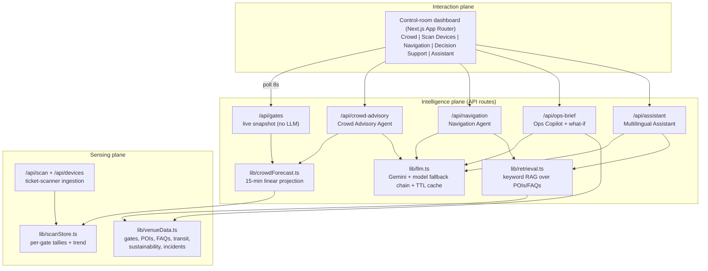

# Architecture

Smart Stadium Ops is organised as three planes, mirroring how a production
FIFA World Cup 2026 venue deployment would be structured: a **sensing plane**
that produces events, an **intelligence plane** that turns raw signals into
decisions, and an **interaction plane** where fans, volunteers, and the
control room consume them.

## Request lifecycle (example: crowd advisory)

1. Ticket scanners (simulated in the **Scan Devices** tab, or real hardware
   calling `POST /api/scan`) stream entry/exit events into the per-gate
   scan store.
2. `projectAllGates()` converts live counts + the last five minutes of scan
   rate into a 15-minute occupancy projection per gate with a
   normal/watch/critical status.
3. `POST /api/crowd-advisory` renders those projections into a prompt and
   asks Gemini for a control-room briefing, a calm public announcement, and
   recommended actions.
4. The response is cached (keyed by the set of gate statuses) for 60s so
   repeated clicks cost no quota; if the LLM is unavailable the route
   degrades to a clearly labeled rules-engine briefing built from the same
   projections.

## Key design decisions

| Decision | Rationale |
| --- | --- |
| Event-driven headcounts (scan ledger) instead of simulated data | Matches how real turnstiles report; the demo's simulator buttons call the exact endpoint hardware would |
| LLM behind one wrapper (`lib/llm.ts`) | Provider-agnostic: swapping Gemini for another model is a one-file change |
| Model fallback chain | Model availability and free-tier quotas differ per key/region; a demo must not die on a 404/429 |
| TTL response cache | Free-tier quotas are per-minute; identical requests should not spend them |
| Rules-engine fallbacks per route | Safety-critical ops tooling must degrade gracefully, never dead-end |
| Human-in-the-loop framing in prompts | The AI recommends; staff approve. Gate closures/evacuations are flagged for supervisor approval |
| Retrieval-grounded prompts | Navigation/assistant answers are constrained to venue data to prevent hallucinated policies or places |
| In-memory stores (scan ledger, cache, rate limiter) | Right-sized for a demo; each is a single-file swap to Redis/Postgres for multi-instance production |

## Production path

- Replace `lib/venueData.ts` samples with live feeds: CCTV people-counting,
  Wi-Fi/BLE heatmaps, host-city transit APIs, smart-meter telemetry.
- Swap the keyword retrieval for a vector database when the knowledge base
  outgrows a single file.
- Move the scan ledger and cache to Redis; add device authentication tokens
  to `/api/scan`.
- Upgrade the linear projection to a learned forecasting model (Prophet/LSTM)
  trained on historical matchday curves.
